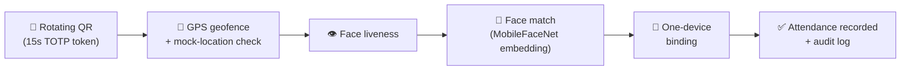

<div align="center">


<a href="https://github.com/NafisUddinElok">
  
</a>

<br/>

[](https://www.linkedin.com/in/nafis-uddin-elok-b6b59a24b/)
[](https://github.com/NafisUddinElok?tab=followers)


</div>

---

## 👋 Hello, world

```js
const nafis = {
  name: "Nafis Uddin Elok",
  studying: "Software Engineering @ SUST",
  building: "Attendence-Tracker — a software-only, anti-proxy attendance system",
  learning: ["React Router v7", "Backend fundamentals"],
  stack: ["Flutter", "Node.js", "PostgreSQL", "React", "C++", "Java"],
  approach: "Ship small, test on a real device, then refine",
  openTo: ["internships", "junior roles", "collaborations"],
};
```

---

## 🚀 Featured project — Attendence-Tracker

> Proxy attendance is a real problem in classrooms. This app makes it hard to fake — using only a phone, no extra hardware.

**Stack:** Flutter · Node.js / Express · PostgreSQL · Socket.IO · JWT



| Layer | What it does |
|---|---|
| 🔐 **Rotating QR** | HMAC-SHA256 token that changes every 15 seconds, so a screenshot is useless |
| 📍 **Geofencing** | Teacher sets a radius per course; students are checked with Haversine distance |
| 🧑‍🦱 **Face verification** | Liveness check plus on-device embedding comparison against the registered face |
| 📱 **Device binding** | One student, one device, locked after first registration |
| 🧾 **Audit trail** | Every attempt — success or failure — is logged with device, location and reason |
| 📊 **Reports** | Per-course export to Excel/CSV with the 75% eligibility rule computed server-side |

<div align="center">

[](https://github.com/NafisUddinElok/Attendence-Tracker)

</div>

---

## 🛠️ Tech toolbox

<div align="center">


<br/>


</div>

---

## 🎮 More things I've built

<div align="center">

[](https://github.com/NafisUddinElok/Backend-fundamentals)
[](https://github.com/NafisUddinElok/Ai-powered-healthcare-System)

[](https://github.com/NafisUddinElok/2D-cyborg-battle-game)
[](https://github.com/NafisUddinElok/Dodge-game-2D)

[](https://github.com/NafisUddinElok/Learning-JavaScript/actions/workflows/main.yml)

</div>

---

## 📊 GitHub at a glance

<div align="center">


</div>

---

## 🤝 Let's connect

I like talking about mobile apps, backend design, and clever ways to make software harder to cheat. If you're working on something interesting, say hi.

<div align="center">

[](https://www.linkedin.com/in/nafis-uddin-elok-b6b59a24b/)
[](https://github.com/NafisUddinElok)

<br/>


</div>