


  
  
  

<b>
  <a href="#about">About</a>&emsp;
  <a href="#build">What I build</a>&emsp;
  <a href="#toolbox">Toolbox</a>&emsp;
  <a href="#projects">Projects</a>&emsp;
  <a href="#activity">Activity</a>&emsp;
  <a href="#contact">Contact</a>
</b>

I'm **Nafis Uddin**, a Software Engineering student at **Shahjalal University of Science and Technology (SUST)**. I build 2D games in C++ and Java, learn backend development with Node.js, and prototype an AI-powered healthcare system. I like code that is well organized: readable game loops, design patterns used on purpose, and projects that are easy to run.

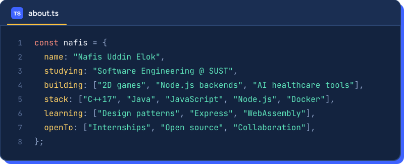

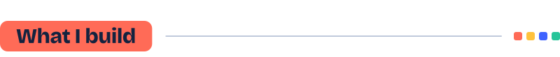

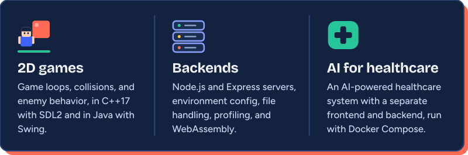

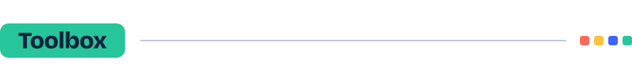

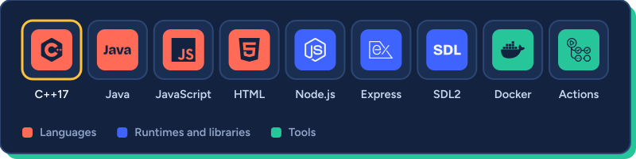

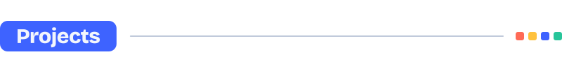

  <a href="https://github.com/NafisUddinElok/2D-cyborg-battle-game">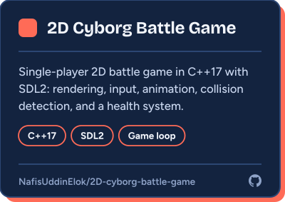</a>
  <a href="https://github.com/NafisUddinElok/Ai-powered-healthcare-System">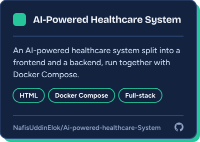</a>

  <a href="https://github.com/NafisUddinElok/Backend-fundamentals">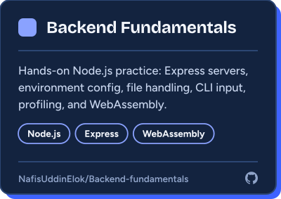</a>
  <a href="https://github.com/NafisUddinElok/Dodge-game-2D">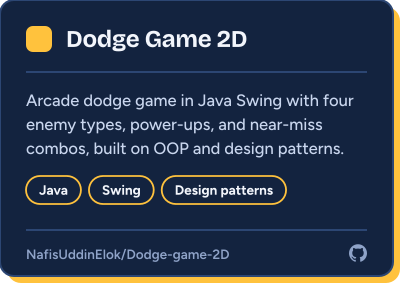</a>

<a href="https://github.com/NafisUddinElok?tab=repositories"><b>Browse all repositories</b></a>

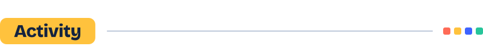

  
  

  

<a href="https://www.linkedin.com/in/nafis-uddin-elok-b6b59a24b/">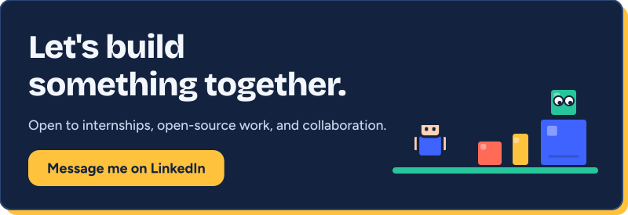</a>

 

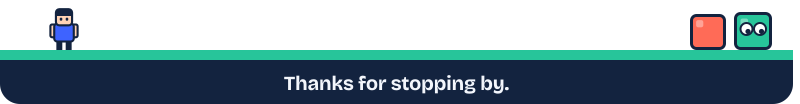
